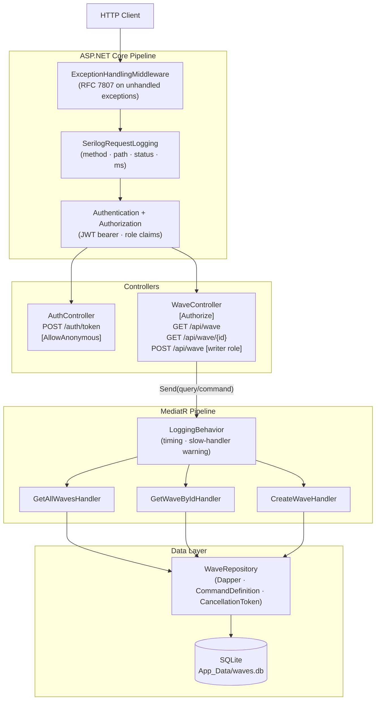

# WaveApiRefactor

Wave (batch order) management API built with ASP.NET Core 9.0, SQLite, Dapper, MediatR, and JWT bearer authentication.

## Running

```bash
dotnet run
```

Swagger UI opens automatically at `http://localhost:5057/swagger`.

### Getting an authenticated token

All wave endpoints require a valid JWT. Use the stub token endpoint first:

```http
POST /auth/token
Content-Type: application/json

{ "username": "palak", "role": "writer" }
```

Paste the returned token into Swagger's **Authorize** dialog (`Bearer <token>`), or send it as:

```
Authorization: Bearer <token>
```

Valid roles: `reader` and `writer`. GET endpoints require any authenticated user; POST `/api/wave` requires the `writer` role.

---

## API

| Method | Route | Auth required | Description |
|--------|-------|---------------|-------------|
| POST | `/auth/token` | None | Issues a signed JWT for the given username and role |
| GET | `/api/wave` | Any authenticated user | Paginated list (`?page=1&pageSize=20`) |
| GET | `/api/wave/{id}` | Any authenticated user | Single wave by GUID; 404 if not found |
| POST | `/api/wave` | Role: `writer` | Creates a new wave; returns 201 with `Location` header |

**POST /api/wave body:**
```json
{ "name": "Wave A", "waveDate": "2025-06-01T00:00:00" }
```

---

## Architecture



---

## What Changed and Why

Every item below was added deliberately; each has a rationale in the Design Decisions section.

| Change | Reason |
|--------|--------|
| Converted minimal APIs → `[ApiController]` controllers | Testability and per-action auth attributes |
| Replaced raw ADO.NET with Dapper | Explicit SQL without ORM ceremony |
| Applied CQRS via MediatR | Single-responsibility handlers; pipeline extensibility |
| Added `LoggingBehavior<TRequest,TResponse>` | Cross-cutting timing/logging without touching handlers |
| Added `ExceptionHandlingMiddleware` | Global error handling; no try/catch in controllers |
| Added Serilog structured logging | Queryable JSON logs for production diagnosis |
| Added JWT bearer authentication | Stateless auth; roles encoded in token claims |
| Added role-based authorisation | Read endpoints open to any authenticated user; write endpoint requires `writer` role |
| Added offset-based pagination | Prevent full-table loads; single DB round-trip via `QueryMultipleAsync` |
| Added `CancellationToken` propagation | Cancels in-flight DB commands when client disconnects |
| Added `Result<T>` pattern | Makes success/failure explicit; eliminates controller try/catch |

---

## Design Decisions

### Dapper over Entity Framework Core

Dapper was chosen as a deliberate lightweight choice. The domain has a single table with a fixed three-column schema : there is nothing to model with change tracking, lazy loading, or migrations. Dapper keeps the SQL explicit and readable, which is valuable when reviewing data-access behaviour in code review or incident investigation.

One additional constraint drove the choice: SQLite stores both `Guid` and `DateTime` as `TEXT`. Dapper required two custom type handlers (`GuidTypeHandler`, `DateTimeTypeHandler`) registered at startup. EF Core handles this via value converters, but the handlers are a few lines each and make the conversion logic visible in code rather than hidden in ORM configuration.

EF Core would be the right call if the schema grew to include multiple related entities requiring navigational queries, or if generated migrations became valuable for schema versioning.

---

### Controllers over Minimal APIs

Classic `[ApiController]` controllers were chosen over Minimal APIs for two reasons.

**Testability.** Each action method is a discrete, independently invocable unit that can be unit-tested by injecting a mock `IMediator`. There is no static route registration to work around.

**Auth attributes.** `[Authorize]` at the class level and `[Authorize(Roles = "writer")]` at the action level pair naturally with controllers. The same outcome is achievable with Minimal APIs using `RequireAuthorization()`, but it must be expressed per-route at registration time, which scatters auth policy decisions across `Program.cs` rather than co-locating them with the endpoint they protect.

Minimal APIs are excellent for latency-sensitive microservices where ceremony matters. For a CRUD API where clarity, testability, and attribute-driven auth are the priority, controllers are the more deliberate choice.

---

### CQRS with MediatR

MediatR was applied to separate read operations (queries) from write operations (commands). This domain has two queries (`GetAllWaves`, `GetWaveById`) and one command (`CreateWave`). Each handler is a single-responsibility class with one clear purpose.

The practical benefit is extensibility via pipeline behaviours. `LoggingBehavior<TRequest, TResponse>` was added as an open behaviour and now wraps every handler automatically : measuring execution time, logging the request, and emitting a warning if a handler takes longer than 500 ms. This cross-cutting concern was added without modifying a single handler. The same mechanism would be used to add validation, caching, or auditing in future.

The counter-argument : that CQRS adds complexity for a three-endpoint API : is valid. The justification here is that the pattern pays for itself the moment a second developer adds a fourth endpoint, because the structure is already in place and the conventions are clear.

---

### Authentication and Authorisation

**Scheme.** JWT bearer authentication via `Microsoft.AspNetCore.Authentication.JwtBearer`. The token is validated on every request against the configured issuer, audience, expiry, and signing key. Validated claims are available as `HttpContext.User`.

**Token issuance.** `POST /auth/token` is a stub endpoint that issues a signed JWT for any supplied `username` and `role` without consulting a credential store. This is intentional for this exercise : the focus is on demonstrating the auth architecture, not implementing a full identity system. The endpoint is marked `[AllowAnonymous]`.

**Roles.** `WaveController` carries `[Authorize]` at the class level — any valid JWT can call the GET endpoints regardless of role. The `Create` action adds `[Authorize(Roles = "writer")]` to restrict writes. The token endpoint accepts `reader` or `writer` as the role value; `reader` is a convenience label for tokens intended for read-only use, but there is no explicit policy enforcing it on the GET endpoints — that would require adding `[Authorize(Roles = "reader,writer")]` or a named policy.

**Configuration.** `Jwt:Key`, `Jwt:Issuer`, `Jwt:Audience`, and `Jwt:ExpiryMinutes` are read from `appsettings.json`. The signing key is hardcoded there for development convenience only.

**Production gaps (known).** The signing key must move to a secrets manager (Azure Key Vault, AWS Secrets Manager, or `dotnet user-secrets` at minimum). The token endpoint must validate credentials against a real user store. A refresh token flow should be added so clients do not need to re-authenticate after 60 minutes.

---

### Error Handling

`ExceptionHandlingMiddleware` is registered first in the ASP.NET Core pipeline so it wraps every downstream component. No controller or handler contains try/catch blocks around business logic : unhandled exceptions propagate naturally to the middleware.

**Exception → status mapping:**

| Exception type | HTTP status |
|---------------|-------------|
| `ArgumentNullException`, `ArgumentException` | 400 Bad Request |
| `KeyNotFoundException` | 404 Not Found |
| `UnauthorizedAccessException` | 403 Forbidden |
| Any other | 500 Internal Server Error |

**Two error response shapes exist.** Domain-level failures (e.g. wave not found) are returned from the controller as `Result<T>.Failure` and produce plain JSON:

```json
{ "error": "Wave with ID ... was not found." }
```

Unhandled exceptions that propagate to `ExceptionHandlingMiddleware` produce RFC 7807 `ProblemDetails`:

```json
{
  "type": "https://tools.ietf.org/html/rfc7807",
  "title": "An unexpected error occurred",
  "status": 500,
  "detail": "An unexpected error occurred",
  "traceId": "0HN..."
}
```

The `traceId` field correlates the HTTP response with the structured log entry. In Development the exception message is used for `detail`; in Production the title is repeated to avoid leaking implementation details.

---

### Structured Logging

Serilog provides structured logging across the application. `ReadFrom.Configuration` means log levels are configurable per environment without redeployment.

**Sinks:**
- **Console** : human-readable `MessageTemplateTextFormatter` in Development; compact JSON in Production
- **File** : compact JSON written to `logs/api-<date>.log`, rolling daily, 30 days retained

**Request logging.** `UseSerilogRequestLogging` emits one structured log entry per HTTP request/response, capturing method, path, status code, and elapsed milliseconds. This replaces the verbose ASP.NET Core access log and provides a consistent format for log aggregation.

**Handler timing.** `LoggingBehavior<TRequest, TResponse>` logs every MediatR handler call with the request name and a serialised copy of the request object. If a handler takes longer than 500 ms a `Warning` is emitted : this is the first signal of a slow query or lock contention without needing application performance monitoring.

**Repository logging.** Each repository method emits a `Debug` log before executing the query and an `Information` or `Warning` log on completion. Repository-level logs are suppressed in Production by default (`MinimumLevel.Default = Information`) and visible in Development (`MinimumLevel.Default = Debug`).

**Log levels used and why:**
- `Debug` : repository query parameters (query entry, wave ID looked up); verbose, suppressed in Production
- `Information` : handler entry and completion, successful operations, HTTP requests, token issuance
- `Warning` : slow handlers (> 500 ms), not-found results, validation failures
- `Error` : unhandled exceptions caught by middleware
- `Fatal` : startup failures that prevent the application from running

---

### Result\<T\> Pattern

`Result<T>` makes the success/failure contract explicit in method signatures rather than relying on exceptions for control flow. Each MediatR handler returns `Result<T>`, and the controller inspects `IsSuccess` to decide the HTTP status code. This keeps the happy path readable, avoids try/catch in the controller, and means that "not found" can be expressed as a typed failure rather than a thrown `KeyNotFoundException` that crosses several stack frames.

The pattern is also the natural complement to `ExceptionHandlingMiddleware`: domain-level failures (wave not found) are modelled as `Result<T>.Failure`; infrastructure failures (database connection lost) propagate as exceptions and are handled centrally.

---

### Pagination

`GET /api/wave` uses offset-based pagination via `?page` and `?pageSize` query parameters (defaults: `page=1`, `pageSize=20`, max page size clamped to 100). The response is a `PagedResponse<WaveResponse>` envelope:

```json
{
  "items": [...],
  "page": 1,
  "pageSize": 20,
  "totalCount": 83,
  "totalPages": 5
}
```

**Offset vs cursor-based.** Offset pagination was chosen because it supports random-access page jumping, maps directly to SQL `LIMIT`/`OFFSET`, and is immediately understandable by API consumers. Cursor-based pagination is superior for high-volume append-only streams where rows can shift between pages as new data arrives, but adds implementation complexity that is not warranted here.

**Single round-trip.** `GetPagedAsync` uses Dapper's `QueryMultipleAsync` to execute both the `COUNT(*)` and the paginated `SELECT` in a single database connection, avoiding two separate connection setups.

**Clamping in the handler.** `page` is clamped to ≥ 1 and `pageSize` is clamped to [1, 100] in `GetAllWavesHandler`, not the controller. The controller sets default values at the HTTP boundary; the handler enforces invariants that the repository must never violate regardless of how it is called. Clamping rather than rejecting keeps the API forgiving of off-by-one mistakes in page indexing.

---

### Cancellation Tokens

Every `IWaveRepository` method accepts a `CancellationToken`, and in the repository each token is passed to Dapper via `CommandDefinition` — Dapper's mechanism for carrying per-command options (timeout, transaction, flags, and cancellation) without requiring separate overloads.

The HTTP request's cancellation token is injected by ASP.NET Core into action methods that declare it as a parameter. Currently only `GetAll` does this (`CancellationToken cancellationToken = default`). `GetById` and `Create` do not declare the parameter, so they receive `CancellationToken.None` — cancellation is not propagated for those two actions. Adding the parameter to those actions would complete the wiring.

---

### Unit of Work : Deliberately Omitted

A Unit of Work wraps multiple repository operations in a single transaction. This domain has one repository targeting one table; there are no cross-repository writes that need to be atomic. Introducing a `IUnitOfWork` abstraction would add a layer of indirection (shared connection, transaction scope, commit/rollback) with no corresponding benefit at this scale. If the domain grows to include related entities : for example, wave line items that must be inserted atomically with the wave header : a Unit of Work wrapping a shared `SqliteConnection` and `IDbTransaction` should be introduced at that point.

---

### Design Patterns Summary

| Pattern | Location | Why applied |
|---------|----------|-------------|
| CQRS + Mediator | `Features/Waves/` (queries + commands) | Single-responsibility handlers; cross-cutting behaviours via pipeline |
| Repository | `IWaveRepository` / `WaveRepository` | Abstracts Dapper; decouples handlers from SQL and connection management |
| Result\<T\> (Railway-Oriented) | `Common/Result.cs` | Explicit success/failure in method signatures; no exceptions for control flow |
| Pipeline Behavior | `Features/Common/LoggingBehavior.cs` | Cross-cutting timing and logging added once, applied to all handlers |
| Middleware | `Middleware/ExceptionHandlingMiddleware.cs` | Centralised exception → HTTP status mapping; no try/catch in controllers |
| DTO / Anti-Corruption Layer | `DTOs/WaveResponse.cs`, `DTOs/CreateWaveRequest.cs` | Domain `Wave` model never serialised to HTTP responses; API contract is independent of domain model |
| Unit of Work | : | **Deliberately omitted** : single table, no cross-repository atomicity required |

---

## What I Would Do Next

Given more time, in rough priority order:

1. **Real authentication.** Replace the stub token endpoint with credential validation against a user store (ASP.NET Core Identity, or a lightweight custom `users` table with BCrypt-hashed passwords). Add refresh tokens and a revocation endpoint.

2. **Secrets management.** Move the JWT signing key out of `appsettings.json` into Azure Key Vault, AWS Secrets Manager, or at minimum `dotnet user-secrets`. No secret should ever be committed to source control.

3. **Request validation.** Add a FluentValidation MediatR pipeline behaviour so validation rules live in dedicated validator classes rather than data annotations on DTOs. This keeps handler code free of `if (string.IsNullOrEmpty(...))` guards.

4. **Integration tests.** Write tests that hit real SQL against SQLite in-memory. Mock-repository tests prove handler logic but cannot catch SQL bugs (wrong column name, missing type handler, off-by-one in OFFSET). Integration tests would cover the full stack from handler to database.

5. **Cursor-based pagination.** For large or fast-moving datasets, add an optional cursor parameter (`?after=<lastId>`) so pages remain stable as new waves are inserted. Keep offset-based pagination for clients that need random-access page jumping.

6. **OpenTelemetry tracing.** Add distributed trace context propagation so a single request can be correlated across logs, metrics, and spans in tools like Jaeger or Zipkin. This pairs with the existing Serilog `TraceId` enrichment.

7. **ETag / conditional GET.** Add `ETag` headers to `GET /api/wave/{id}` responses and honour `If-None-Match` to return 304 Not Modified for unchanged resources, reducing unnecessary payload transfer.

8. **Rate limiting.** Apply ASP.NET Core 7+ rate-limiting middleware to the token endpoint (prevent brute force) and the write endpoint (prevent runaway batch inserts).
